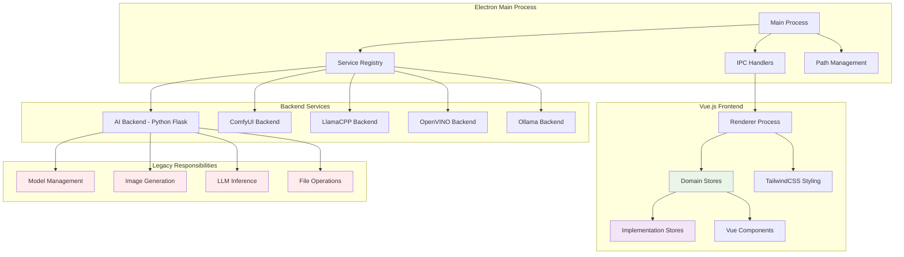
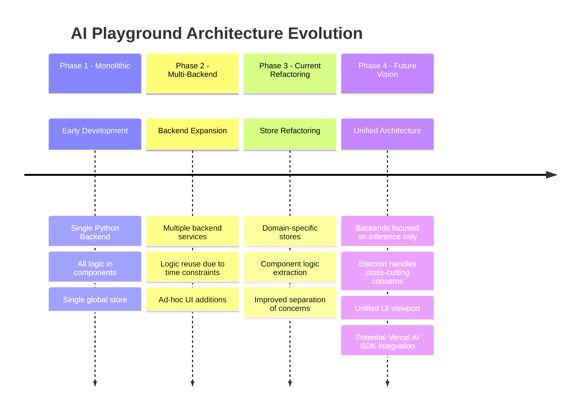
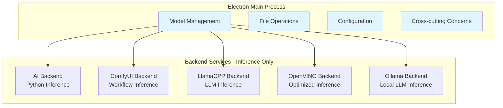
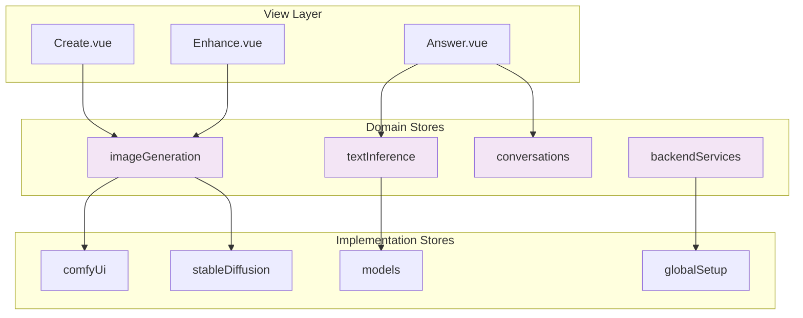
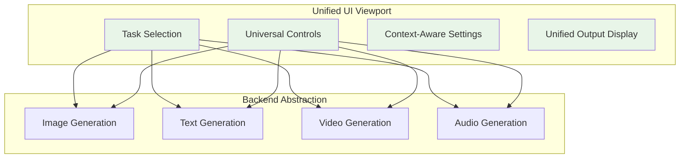
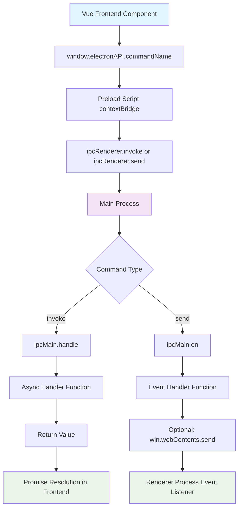

# AI Playground Agent Guide

This document serves as a comprehensive guide for AI agents working with the AI Playground codebase. It provides essential context, patterns, and conventions to help agents understand and effectively contribute to this project.

## Project Overview

AI Playground is a standalone Electron application that enables users with Intel graphics cards to interact with generative AI via a graphical user interface. It supports image generation (Stable Diffusion, SDXL, Flux.1), LLM inference, and various AI workflows.

### Key Features
- **Multi-Backend Support**: AI-backend, ComfyUI, LlamaCPP, OpenVINO, Ollama
- **Image Generation**: Text-to-image, image-to-image, inpainting, outpainting, upscaling
- **LLM Chat**: Conversational AI with RAG support
- **Model Management**: Automatic downloading and management of AI models
- **Workflow System**: Pre-configured and customizable AI workflows

## Architecture Overview

AI Playground follows a multi-process architecture with Electron orchestrating communication between a Vue.js frontend and multiple specialized backend services. This architecture has evolved significantly from its original monolithic design - see [Development Philosophy & Future Direction](#development-philosophy--future-direction) for the complete evolution story.

### Current Architecture



### Architectural Layers

#### 1. Electron Main Process Layer
- **Service Registry**: Manages lifecycle of all backend services
- **IPC Communication**: Handles secure communication between frontend and backends
- **Path Management**: Centralized model and resource path management
- **Process Orchestration**: Coordinates startup, shutdown, and health monitoring

#### 2. Frontend Layer (Vue.js + Pinia)
The frontend has evolved from a component-heavy architecture to a store-driven approach:

**Domain Stores** (Green in diagram):
- [`imageGeneration`](WebUI/src/assets/js/store/imageGeneration.ts) - Orchestrates image generation workflows
- [`textInference`](WebUI/src/assets/js/store/textInference.ts) - Manages LLM interactions and conversations
- [`backendServices`](WebUI/src/assets/js/store/backendServices.ts) - Backend service management

**Implementation Stores** (Purple in diagram):
- [`comfyUi`](WebUI/src/assets/js/store/comfyUi.ts) - ComfyUI-specific workflow processing
- [`stableDiffusion`](WebUI/src/assets/js/store/stableDiffusion.ts) - Default backend image generation
- [`models`](WebUI/src/assets/js/store/models.ts) - Model discovery and management

#### 3. Backend Services Layer
Multiple specialized services handle different inference engines:

- **AI Backend** ([`service/`](service/)) - Primary Python Flask service (legacy responsibilities in red)
- **ComfyUI Backend** - Node-based workflow processing
- **LlamaCPP Backend** ([`LlamaCPP/`](LlamaCPP/)) - CPU-optimized LLM inference
- **OpenVINO Backend** ([`OpenVINO/`](OpenVINO/)) - Intel-optimized inference
- **Ollama Backend** - Local LLM management and inference (preview)

### Evolution Highlights

**Legacy Issues** (highlighted in red):
- Model management logic scattered across backends
- Cross-cutting concerns duplicated between services
- Inconsistent patterns between different backends

**Current Improvements** (highlighted in green/purple):
- Domain-driven store architecture separating business logic from UI
- Clear separation between orchestration stores and implementation stores
- Improved component reusability and testability

**Future Direction**:
The architecture is evolving toward inference-focused backends with Electron handling all cross-cutting concerns. See the [Future Vision](#future-vision-inference-focused-backends) section for detailed plans.

## Development Philosophy & Future Direction

This section provides crucial context about the architectural evolution of AI Playground, helping developers understand why the current structure exists and where the project is heading. This historical perspective is essential for making informed decisions when contributing to the codebase.

### Architectural Evolution Timeline



### Backend Architecture Evolution

#### Historical Context
Originally, AI Playground had a single Python backend service ([`service/`](service/)) that handled all application logic, including:
- Model downloads and management
- Image generation inference
- LLM inference
- File operations
- Configuration management

This monolithic approach worked well initially but became a bottleneck as the application grew in complexity and feature scope.

#### Current Multi-Backend State
When additional backends were introduced to support different inference engines, time constraints led to a pragmatic but suboptimal approach:

**Current Backend Services:**
- **[`service/`](service/)** - Primary Python backend (Flask) - Still contains legacy cross-cutting logic
- **[`LlamaCPP/`](LlamaCPP/)** - LlamaCPP inference service
- **[`OpenVINO/`](OpenVINO/)** - OpenVINO inference service
- **ComfyUI Backend** - Node-based workflow processing
- **Ollama Backend** - Ollama model inference (preview)

**Current Issues:**
- Cross-cutting concerns (like model downloading) are partially duplicated across backends
- Business logic is scattered between the primary backend and newer services
- Inconsistent patterns between different backend implementations

#### Future Vision: Inference-Focused Backends
The target architecture separates concerns more cleanly:



**Benefits of Future Architecture:**
- **Single Responsibility**: Each backend focuses solely on inference tasks
- **Consistency**: Unified model management and configuration through Electron
- **Maintainability**: Reduced code duplication and clearer separation of concerns
- **Scalability**: Easier to add new inference backends without duplicating infrastructure

### Frontend Architecture Evolution

#### Historical Context: Component-Heavy Architecture
Initially, the frontend followed a common pattern where:
- All application state lived in a single global store
- Business logic was embedded directly in Vue components
- Components like [`Create.vue`](WebUI/src/views/Create.vue) and [`App.vue`](WebUI/src/App.vue) contained complex state management and API calls

**Problems with Original Approach:**
- Components became bloated with business logic
- State management was scattered and hard to track
- Testing was difficult due to tight coupling
- Code reuse was limited

#### Current Refactoring: Domain-Driven Stores
The project is actively refactoring toward a more maintainable architecture using domain-specific Pinia stores:

**Current Store Architecture:**


**Example: Image Generation Store Evolution**
The [`imageGeneration`](WebUI/src/assets/js/store/imageGeneration.ts) store now orchestrates between:
- [`comfyUi`](WebUI/src/assets/js/store/comfyUi.ts) store for ComfyUI workflow processing
- [`stableDiffusion`](WebUI/src/assets/js/store/stableDiffusion.ts) store for default backend processing

This allows [`Create.vue`](WebUI/src/views/Create.vue) to focus on presentation while the stores handle business logic and state management.

#### Future Vision: Complete Domain Separation
The target is to complete the refactoring with:
- **Pure Presentation Components**: Views handle only UI concerns
- **Domain-Specific Stores**: Each store manages a specific business domain
- **Clear Data Flow**: Unidirectional data flow with predictable state updates
- **Improved Testability**: Business logic separated from UI components

### UI Consistency Challenges

#### Current Inconsistencies
The rapid addition of new backends and features has led to UI inconsistencies:

**Examples of Current Issues:**
- **ComfyUI Workflows**: Managed through the settings tab rather than integrated into the main workflow
- **LLM Settings**: Directly embedded in [`Answer.vue`](WebUI/src/views/Answer.vue) instead of following a consistent pattern
- **Backend-Specific Controls**: Each backend has different UI patterns for similar functionality

**Impact on User Experience:**
- Users must learn different interaction patterns for different features
- Cognitive load increases as the interface becomes less predictable
- Feature discoverability suffers when controls are scattered

#### Future Vision: Unified UI Viewport
The long-term vision is a unified interface where:



**Benefits of Unified UI:**
- **Consistent Experience**: Same interaction patterns across all AI tasks
- **Reduced Learning Curve**: Users learn one interface for all functionality
- **Better Discoverability**: All features accessible from a single viewport
- **Simplified Development**: Consistent UI patterns reduce development complexity

### Technology Considerations

#### Vercel AI SDK Integration
There's a small proof-of-concept implementation using the [Vercel AI SDK](https://sdk.vercel.ai/) in [`Answer.vue`](WebUI/src/views/Answer.vue) (lines 611-635). This SDK could potentially help with:

**Current Manual Implementations:**
- Output parsing and structuring
- Streaming response handling
- Error handling patterns
- Token counting and metrics

**Potential Benefits:**
- **Reduced Boilerplate**: SDK handles common AI interaction patterns
- **Standardized APIs**: Consistent interface across different AI providers
- **Built-in Features**: Streaming, error handling, and response formatting
- **Community Support**: Well-maintained with regular updates

**Considerations for Adoption:**
- **Bundle Size**: Evaluate impact on application size
- **Flexibility**: Ensure SDK doesn't limit custom functionality needs
- **Migration Path**: Plan gradual adoption without breaking existing features

### Development Guidelines for Contributors

#### When Working on Backend Services
1. **New Features**: Consider whether logic belongs in Electron (cross-cutting) or backend (inference-specific)
2. **Model Management**: Avoid duplicating model download logic; use existing patterns
3. **Configuration**: Prefer centralized configuration over service-specific settings
4. **Error Handling**: Follow established patterns for consistent error reporting

#### When Working on Frontend Stores
1. **Domain Focus**: Keep stores focused on specific business domains
2. **Component Separation**: Extract business logic from components into stores
3. **State Management**: Use Pinia patterns consistently across all stores
4. **Testing**: Write tests for store logic separately from component tests

#### When Working on UI Components
1. **Consistency**: Follow established UI patterns rather than creating new ones
2. **Accessibility**: Ensure new components follow accessibility guidelines
3. **Responsive Design**: Consider different screen sizes and use cases
4. **Future-Proofing**: Design with the unified UI vision in mind

This architectural context should help you make informed decisions that align with the project's evolution toward a more maintainable and user-friendly application.

## Technology Stack

### Frontend
- **Framework**: Vue.js 3.5+ with Composition API
- **Build Tool**: Vite 7.0+
- **State Management**: Pinia with persistence
- **Styling**: TailwindCSS 4.1+ with custom CSS variables
- **UI Components**: shadcn (vue) using Radix Vue (reka-ui) with custom components
- **TypeScript**: 5.8+ with strict configuration
- **Desktop**: Electron 37.2+

### Backend Services
- **Primary Backend**: Python Flask with APIFlask
- **Model Inference**: PyTorch, Diffusers, Transformers
- **Intel Optimization**: IPEX-LLM, OpenVINO
- **Embedding**: Sentence Transformers, FAISS
- **Image Processing**: PIL, OpenCV, BasicSR

### Development Tools
- **Linting**: ESLint with Vue and TypeScript configs
- **Formatting**: Prettier
- **Testing**: Vitest
- **Package Manager**: npm

## Project Structure

```
AI-Playground/
├── WebUI/                          # Electron frontend application
│   ├── electron/                   # Electron main process
│   │   ├── main.ts                # Main entry point
│   │   ├── subprocesses/          # Backend service management
│   │   └── pathsManager.ts        # Model path management
│   ├── src/                       # Vue.js application
│   │   ├── components/            # Reusable Vue components
│   │   ├── views/                 # Page-level components
│   │   ├── assets/js/store/       # Pinia stores
│   │   └── lib/                   # Utility functions
│   └── external/                  # External resources and workflows
├── service/                       # Primary Python backend
│   ├── web_api.py                # Flask API endpoints
│   ├── llm_biz.py                # LLM business logic
│   ├── paint_biz.py              # Image generation logic
│   └── models/                   # Model storage directory
├── LlamaCPP/                     # LlamaCPP backend service
├── OpenVINO/                     # OpenVINO backend service
├── backend-shared/               # Shared backend utilities
└── docs/                         # Documentation
```

## Coding Patterns and Conventions

### Vue.js Components

**Composition API Pattern:**
```typescript
<script setup lang="ts">
import type { HTMLAttributes } from 'vue'
import { cn } from '@/lib/utils'

const props = defineProps<{
  modelValue?: string
  class?: HTMLAttributes['class']
}>()

const emits = defineEmits<{
  (e: 'update:modelValue', value: string): void
}>()

// Use composables for reactive state
const { someState } = useSomeComposable()
</script>
```

**Component Naming:**
- Use PascalCase for component files: `MyComponent.vue`
- Use kebab-case in templates: `<my-component>`
- Prefix UI components with descriptive names: `AipgInput.vue`

### TypeScript Interfaces

**Service Interfaces:**
```typescript
interface ApiService {
  readonly name: string
  readonly baseUrl: string
  readonly port: number
  readonly isRequired: boolean
  currentStatus: BackendStatus
  isSetUp: boolean

  start(): Promise<BackendStatus>
  stop(): Promise<BackendStatus>
  set_up(): AsyncIterable<SetupProgress>
}
```

**Backend Service Names:**
- `'ai-backend'` - Primary Python service (required)
- `'comfyui-backend'` - ComfyUI service
- `'llamacpp-backend'` - LlamaCPP service
- `'openvino-backend'` - OpenVINO service
- `'ollama-backend'` - Ollama service (preview)

### Python Backend Patterns

**Flask API Structure:**
```python
@app.post("/api/endpoint")
@app.input(RequestSchema, location='json', arg_name='request_data')
def endpoint_handler(request_data: RequestBody):
    try:
        # Business logic
        result = process_request(request_data)
        return jsonify({"code": 0, "message": "success", "data": result})
    except Exception as e:
        return jsonify({"code": -1, "message": str(e)}), 500
```

**SSE (Server-Sent Events) Pattern:**
```python
def sse_generator():
    for progress in long_running_task():
        yield f"data: {json.dumps(progress)}\n\n"

return Response(stream_with_context(sse_generator()), 
                content_type="text/event-stream")
```

## Backend Service Architecture

### Service Registry Pattern
All backend services are managed through `ApiServiceRegistry`:

```typescript
// Service registration in main.ts
const serviceRegistry = await aiplaygroundApiServiceRegistry(win, settings)

// Services are registered with dynamic ports
instance.register(new AiBackendService('ai-backend', port, win, settings))
instance.register(new ComfyUiBackendService('comfyui-backend', port, win, settings))
```

### IPC Communication
Frontend-backend communication uses Electron IPC:

```typescript
// In main.ts
ipcMain.handle('getServices', () => {
  return serviceRegistry.getServiceInformation()
})

// In frontend
const services = await window.electronAPI.getServices()
```

## Adding New IPC Commands

This section provides a comprehensive guide for adding new Inter-Process Communication (IPC) commands between the Electron renderer (frontend) and main processes. Every IPC command follows a consistent three-file pattern that ensures type safety and proper communication.

### IPC Architecture Overview



### Three-File Pattern

Every new IPC command requires modifications to exactly three files:

1. **[`WebUI/electron/main.ts`](WebUI/electron/main.ts)** - Main process handler
2. **[`WebUI/electron/preload.ts`](WebUI/electron/preload.ts)** - Context bridge exposure
3. **[`WebUI/src/env.d.ts`](WebUI/src/env.d.ts)** - TypeScript type definitions

### IPC Command Types

#### 1. Invoke Commands (Request-Response)
Use for operations that need to return data to the frontend.

**Pattern**: `ipcRenderer.invoke()` ↔ `ipcMain.handle()`

**Example: Adding a `getSystemInfo` command**

**Step 1: Add handler in [`main.ts`](WebUI/electron/main.ts)**
```typescript
ipcMain.handle('getSystemInfo', async () => {
  return {
    platform: process.platform,
    arch: process.arch,
    nodeVersion: process.version,
    electronVersion: process.versions.electron
  }
})
```

**Step 2: Expose in [`preload.ts`](WebUI/electron/preload.ts)**
```typescript
contextBridge.exposeInMainWorld('electronAPI', {
  // ... existing methods
  getSystemInfo: () => ipcRenderer.invoke('getSystemInfo'),
})
```

**Step 3: Add type definition in [`env.d.ts`](WebUI/src/env.d.ts)**
```typescript
type electronAPI = {
  // ... existing methods
  getSystemInfo(): Promise<{
    platform: string
    arch: string
    nodeVersion: string
    electronVersion: string
  }>
}
```

**Frontend Usage:**
```typescript
const systemInfo = await window.electronAPI.getSystemInfo()
console.log('Platform:', systemInfo.platform)
```

#### 2. Send Commands (Fire-and-Forget)
Use for operations that don't need to return data.

**Pattern**: `ipcRenderer.send()` ↔ `ipcMain.on()`

**Example: Adding a `logUserAction` command**

**Step 1: Add handler in [`main.ts`](WebUI/electron/main.ts)**
```typescript
ipcMain.on('logUserAction', (_event: IpcMainEvent, action: string, details?: any) => {
  appLogger.info(`User action: ${action}`, 'user-tracking', details)
})
```

**Step 2: Expose in [`preload.ts`](WebUI/electron/preload.ts)**
```typescript
contextBridge.exposeInMainWorld('electronAPI', {
  // ... existing methods
  logUserAction: (action: string, details?: any) =>
    ipcRenderer.send('logUserAction', action, details),
})
```

**Step 3: Add type definition in [`env.d.ts`](WebUI/src/env.d.ts)**
```typescript
type electronAPI = {
  // ... existing methods
  logUserAction(action: string, details?: any): void
}
```

**Frontend Usage:**
```typescript
window.electronAPI.logUserAction('button_click', { buttonId: 'generate' })
```

#### 3. Streaming Commands (With Progress Updates)
Use for long-running operations that need to send progress updates.

**Pattern**: `ipcRenderer.invoke()` + `win.webContents.send()` + event listeners

**Example: Adding a `processLargeFile` command**

**Step 1: Add handler in [`main.ts`](WebUI/electron/main.ts)**
```typescript
ipcMain.handle('processLargeFile', async (_event: IpcMainInvokeEvent, filePath: string) => {
  const win = BrowserWindow.fromWebContents(_event.sender)
  if (!win) return { success: false, error: 'Window not found' }

  try {
    for (let i = 0; i <= 100; i += 10) {
      // Simulate processing
      await new Promise(resolve => setTimeout(resolve, 100))
      
      // Send progress update
      win.webContents.send('fileProcessProgress', {
        filePath,
        progress: i,
        status: i === 100 ? 'completed' : 'processing'
      })
      
      if (i === 100) break
    }
    
    return { success: true, result: 'File processed successfully' }
  } catch (error) {
    win.webContents.send('fileProcessProgress', {
      filePath,
      progress: 0,
      status: 'failed',
      error: error.message
    })
    return { success: false, error: error.message }
  }
})
```

**Step 2: Expose in [`preload.ts`](WebUI/electron/preload.ts)**
```typescript
contextBridge.exposeInMainWorld('electronAPI', {
  // ... existing methods
  processLargeFile: (filePath: string) => ipcRenderer.invoke('processLargeFile', filePath),
  onFileProcessProgress: (callback: (data: FileProcessProgress) => void) =>
    ipcRenderer.on('fileProcessProgress', (_event, value) => callback(value)),
})
```

**Step 3: Add type definition in [`env.d.ts`](WebUI/src/env.d.ts)**
```typescript
type FileProcessProgress = {
  filePath: string
  progress: number
  status: 'processing' | 'completed' | 'failed'
  error?: string
}

type electronAPI = {
  // ... existing methods
  processLargeFile(filePath: string): Promise<{ success: boolean; result?: string; error?: string }>
  onFileProcessProgress(callback: (data: FileProcessProgress) => void): void
}
```

**Frontend Usage:**
```typescript
// Set up progress listener
window.electronAPI.onFileProcessProgress((progress) => {
  console.log(`Processing ${progress.filePath}: ${progress.progress}%`)
  if (progress.status === 'completed') {
    console.log('File processing completed!')
  } else if (progress.status === 'failed') {
    console.error('File processing failed:', progress.error)
  }
})

// Start processing
const result = await window.electronAPI.processLargeFile('/path/to/file.txt')
if (result.success) {
  console.log('Processing initiated successfully')
} else {
  console.error('Failed to start processing:', result.error)
}
```

### TypeScript Integration Requirements

#### Type Safety Best Practices

1. **Always define return types explicitly:**
```typescript
// Good
getSystemInfo(): Promise<SystemInfo>

// Avoid
getSystemInfo(): Promise<any>
```

2. **Use proper parameter typing:**
```typescript
// Good
logUserAction(action: string, details?: Record<string, any>): void

// Avoid
logUserAction(action: any, details?: any): void
```

3. **Define custom types for complex data:**
```typescript
type SystemInfo = {
  platform: string
  arch: string
  nodeVersion: string
  electronVersion: string
}

type electronAPI = {
  getSystemInfo(): Promise<SystemInfo>
}
```

#### Common Type Patterns

**For service-related commands:**
```typescript
type ServiceCommand = {
  serviceName: BackendServiceName
  action: 'start' | 'stop' | 'restart'
  options?: Record<string, any>
}
```

**For file operations:**
```typescript
type FileOperation = {
  operation: 'read' | 'write' | 'delete'
  path: string
  data?: string | Buffer
}
```

**For progress callbacks:**
```typescript
type ProgressCallback<T = any> = {
  progress: number
  status: 'pending' | 'processing' | 'completed' | 'failed'
  data?: T
  error?: string
}
```

### Error Handling Patterns

#### Main Process Error Handling
```typescript
ipcMain.handle('riskyOperation', async (_event, params) => {
  try {
    const result = await performRiskyOperation(params)
    return { success: true, data: result }
  } catch (error) {
    appLogger.error(`Risky operation failed: ${error.message}`, 'ipc-handler')
    return {
      success: false,
      error: error.message,
      code: error.code || 'UNKNOWN_ERROR'
    }
  }
})
```

#### Frontend Error Handling
```typescript
try {
  const result = await window.electronAPI.riskyOperation(params)
  if (result.success) {
    // Handle success
    console.log('Operation completed:', result.data)
  } else {
    // Handle known errors
    console.error('Operation failed:', result.error)
    showErrorMessage(result.error)
  }
} catch (error) {
  // Handle unexpected errors
  console.error('Unexpected error:', error)
  showErrorMessage('An unexpected error occurred')
}
```

### Common Patterns and Examples

#### Backend Service Integration
Many IPC commands interact with backend services. Follow this pattern:

```typescript
ipcMain.handle('customServiceOperation', async (_event, serviceName: string, operation: any) => {
  if (!serviceRegistry) {
    return { success: false, error: 'Service registry not ready' }
  }
  
  const service = serviceRegistry.getService(serviceName)
  if (!service) {
    return { success: false, error: `Service ${serviceName} not found` }
  }
  
  try {
    const result = await service.performOperation(operation)
    return { success: true, data: result }
  } catch (error) {
    return { success: false, error: error.message }
  }
})
```

#### File System Operations
For file system operations, use Electron's dialog APIs:

```typescript
ipcMain.handle('selectAndProcessFile', async (event) => {
  const win = BrowserWindow.fromWebContents(event.sender)
  if (!win) return { success: false, error: 'Window not found' }
  
  const result = await dialog.showOpenDialog(win, {
    properties: ['openFile'],
    filters: [{ name: 'Text Files', extensions: ['txt', 'md'] }]
  })
  
  if (result.canceled) {
    return { success: false, error: 'User canceled' }
  }
  
  // Process the selected file
  const filePath = result.filePaths[0]
  const content = await fs.promises.readFile(filePath, 'utf-8')
  
  return { success: true, data: { filePath, content } }
})
```

### Troubleshooting Common Issues

#### 1. "Cannot read property of undefined" in frontend
**Cause**: Missing type definition or incorrect method name
**Solution**: Verify all three files are updated and method names match exactly

#### 2. IPC handler not responding
**Cause**: Handler not registered or incorrect event name
**Solution**: Check that `ipcMain.handle()` or `ipcMain.on()` is called with exact same name as in preload

#### 3. TypeScript errors in frontend
**Cause**: Missing or incorrect type definitions
**Solution**: Ensure `env.d.ts` has proper type definitions for the new command

#### 4. Context isolation errors
**Cause**: Trying to access Node.js APIs directly in renderer
**Solution**: All Node.js operations must go through IPC, never bypass the preload script

#### 5. Memory leaks with event listeners
**Cause**: Not removing event listeners properly
**Solution**: Use `ipcRenderer.removeListener()` or `ipcRenderer.removeAllListeners()` when component unmounts

```typescript
// In Vue component
onUnmounted(() => {
  window.electronAPI.removeFileProcessListener?.()
})
```

### Testing IPC Commands

#### Unit Testing Main Process Handlers
```typescript
// In electron/test/ipc.test.ts
import { ipcMain } from 'electron'

describe('IPC Handlers', () => {
  it('should handle getSystemInfo correctly', async () => {
    const mockEvent = { sender: { id: 1 } }
    const handler = ipcMain.listeners('getSystemInfo')[0]
    
    const result = await handler(mockEvent)
    
    expect(result).toHaveProperty('platform')
    expect(result).toHaveProperty('arch')
  })
})
```

#### Integration Testing
```typescript
// Test full IPC flow
it('should communicate between renderer and main', async () => {
  const result = await window.electronAPI.getSystemInfo()
  expect(result.platform).toBeDefined()
})
```

### Performance Considerations

1. **Avoid frequent IPC calls**: Batch operations when possible
2. **Use appropriate command types**: Don't use invoke for fire-and-forget operations
3. **Handle large data carefully**: Consider streaming for large payloads
4. **Clean up listeners**: Remove event listeners to prevent memory leaks

### Security Considerations

1. **Validate all inputs**: Never trust data from renderer process
2. **Use context isolation**: Never disable context isolation
3. **Limit exposed APIs**: Only expose necessary functionality through preload
4. **Sanitize file paths**: Validate and sanitize all file system operations

```typescript
// Good: Validate input
ipcMain.handle('readFile', async (_event, filePath: string) => {
  if (!filePath || typeof filePath !== 'string') {
    throw new Error('Invalid file path')
  }
  
  // Ensure path is within allowed directories
  const normalizedPath = path.normalize(filePath)
  if (!normalizedPath.startsWith(allowedDirectory)) {
    throw new Error('Access denied')
  }
  
  return fs.promises.readFile(normalizedPath, 'utf-8')
})
```

This comprehensive guide should enable you to add any type of IPC command while maintaining the application's architecture, type safety, and security standards.

## State Management with Pinia

### Store Structure
```typescript
export const useBackendServices = defineStore('backendServices', () => {
  const currentServiceInfo = ref<ApiServiceInformation[]>([])
  
  const startService = async (serviceName: string) => {
    return await window.electronAPI.sendStartSignal(serviceName)
  }
  
  return {
    currentServiceInfo,
    startService,
    // ... other methods
  }
}, {
  persist: true // Enable persistence
})
```

### Store Usage in Components
```typescript
<script setup lang="ts">
const backendServices = useBackendServices()
const { currentServiceInfo } = storeToRefs(backendServices)
</script>
```

## Model Management

### Model Types and Paths
```typescript
interface ModelPaths {
  llm: string                    // LLM checkpoints
  embedding: string              // Embedding models
  stableDiffusion: string        // SD checkpoints
  inpaint: string               // Inpainting models
  lora: string                  // LoRA adapters
  vae: string                   // VAE models
}
```

### Model Download Pattern
Models are downloaded via the primary backend service with progress tracking:

```python
@app.post("/api/downloadModel")
def download_model(download_request_data: DownloadModelRequestBody):
    adapter = Model_Downloader_Adapter(hf_token=get_bearer_token(request))
    iterator = adapter.download(download_request_data.data)
    return Response(stream_with_context(iterator), content_type="text/event-stream")
```
 Workflow System

### Workflow Structure
Workflows are JSON files defining AI generation pipelines:

```json
{
  "customNodes": ["repo@commit"],
  "requiredModels": [
    {
      "type": "unet",
      "model": "path/to/model.safetensors"
    }
  ],
  "workflow": {
    // ComfyUI workflow definition
  }
}
```

### Workflow Types
- **ComfyUI Workflows**: Complex node-based workflows in `WebUI/external/workflows/`
- **Default Workflows**: Simple predefined workflows
- **Intel Workflows**: Official Intel-provided workflows

## Development Workflows

### Starting Development
```bash
# Install dependencies
cd WebUI
npm install

# Prepare Python environment
npm run fetch-build-resources -- --conda_env_dir=<path_to_conda_env>
npm run prepare-build

# Start development mode
npm run dev
```

### Building
```bash
# Build installer
npm run build
```

### Code Quality
```bash
# Linting
npm run lint

# Formatting
npm run format

# Testing
npm run test
```

## File Naming Conventions

### Frontend Files
- **Components**: PascalCase (`MyComponent.vue`)
- **Stores**: camelCase (`backendServices.ts`)
- **Types**: camelCase with `.d.ts` extension (`types.d.ts`)
- **Utilities**: camelCase (`utils.ts`)

### Backend Files
- **Python modules**: snake_case (`web_api.py`)
- **Business logic**: snake_case with suffix (`llm_biz.py`, `paint_biz.py`)
- **Adapters**: snake_case with suffix (`sd_adapter.py`)

## Common Patterns

### Error Handling
```typescript
// Frontend error handling
try {
  const result = await apiCall()
  // Handle success
} catch (error) {
  console.error('Operation failed:', error)
  // Show user-friendly error message
}
```

```python
# Backend error handling
try:
    result = process_data()
    return jsonify({"code": 0, "data": result})
except Exception as e:
    traceback.print_exc()
    return jsonify({"code": -1, "message": str(e)}), 500
```

### Async Operations
```typescript
// Use async/await consistently
const processData = async () => {
  const data = await fetchData()
  return await transformData(data)
}
```

### Reactive State
```typescript
// Use ref for primitives, reactive for objects
const count = ref(0)
const user = reactive({ name: '', email: '' })

// Use computed for derived state
const displayName = computed(() => user.name || 'Anonymous')
```

## Debugging and Troubleshooting

### Frontend Debugging
- **Dev Tools**: Available in development mode (`Ctrl+Shift+I`)
- **Vue DevTools**: Integrated for component inspection
- **Console Logging**: Use `console.log`, `console.error` for debugging
- **Network Tab**: Monitor API calls and responses

### Backend Debugging
- **Logging**: Python logging configured to stdout
- **Traceback**: Full stack traces printed on exceptions
- **Service Status**: Check service registry for backend health

### Common Issues
1. **Service Not Starting**: Check port conflicts and dependencies
2. **Model Loading Errors**: Verify model paths and permissions
3. **IPC Communication**: Ensure proper event handling between processes
4. **Memory Issues**: Monitor GPU memory usage during inference

## Performance Considerations

### Frontend
- **Lazy Loading**: Use dynamic imports for large components
- **Virtual Scrolling**: For large lists of items
- **Debouncing**: For search inputs and API calls
- **Caching**: Store frequently accessed data

### Backend
- **Model Caching**: Keep models in memory when possible
- **Resource Management**: Dispose of unused models
- **Batch Processing**: Process multiple requests together
- **GPU Memory**: Monitor and manage VRAM usage

## Security Considerations

### Admin Permissions
- Application prevents running with admin privileges for security
- Uses `sudo-prompt` for elevated operations when necessary

### File Access
- Sandboxed file operations through Electron APIs
- Validates file paths and extensions
- Secure model downloading with token authentication

### Network Security
- CORS headers configured for local development
- Bearer token authentication for HuggingFace API
- Local-only service bindings (127.0.0.1)

## Testing Guidelines

### Unit Testing
```typescript
// Use Vitest for unit tests
import { describe, it, expect } from 'vitest'
import { mount } from '@vue/test-utils'
import MyComponent from './MyComponent.vue'

describe('MyComponent', () => {
  it('renders correctly', () => {
    const wrapper = mount(MyComponent)
    expect(wrapper.text()).toContain('Expected text')
  })
})
```

### Integration Testing
- Test IPC communication between main and renderer processes
- Test backend service startup and shutdown
- Test model loading and inference pipelines

## Contributing Guidelines

### Code Style
- Follow ESLint and Prettier configurations
- Use TypeScript strict mode
- Write descriptive commit messages
- Add JSDoc comments for complex functions

### Pull Request Process
1. Create feature branch from `dev`
2. Implement changes with tests
3. Run linting and formatting
4. Test on target hardware (Intel Arc GPU)
5. Submit PR with detailed description

### Documentation
- Update this AGENT.md for architectural changes
- Add inline comments for complex logic
- Update README.md for user-facing changes
- Document new API endpoints

## Useful Commands and Scripts

### Development
```bash
# Start with debug tools
npm run dev

# Build for production
npm run build

# Check TypeScript
vue-tsc --noEmit

# Update workflows from Intel repo
# (Available through UI)
```

### Debugging
```bash
# Check service status
# Available through frontend UI

# View logs
# Check console output in development mode

# Reset application state
# Clear browser storage in dev tools
```

## Key Files to Understand

### Critical Files
- [`WebUI/electron/main.ts`](WebUI/electron/main.ts) - Electron main process entry point
- [`service/web_api.py`](service/web_api.py) - Primary backend API
- [`WebUI/src/assets/js/store/backendServices.ts`](WebUI/src/assets/js/store/backendServices.ts) - Service management store
- [`WebUI/electron/subprocesses/apiServiceRegistry.ts`](WebUI/electron/subprocesses/apiServiceRegistry.ts) - Service registry

### Configuration Files
- [`WebUI/package.json`](WebUI/package.json) - Frontend dependencies and scripts
- [`service/requirements.txt`](service/requirements.txt) - Python dependencies
- [`WebUI/tsconfig.json`](WebUI/tsconfig.json) - TypeScript configuration
- [`WebUI/eslint.config.ts`](WebUI/eslint.config.ts) - ESLint configuration

This guide should provide you with the essential knowledge needed to work effectively with the AI Playground codebase. Remember to always test changes on the target hardware and follow the established patterns and conventions.