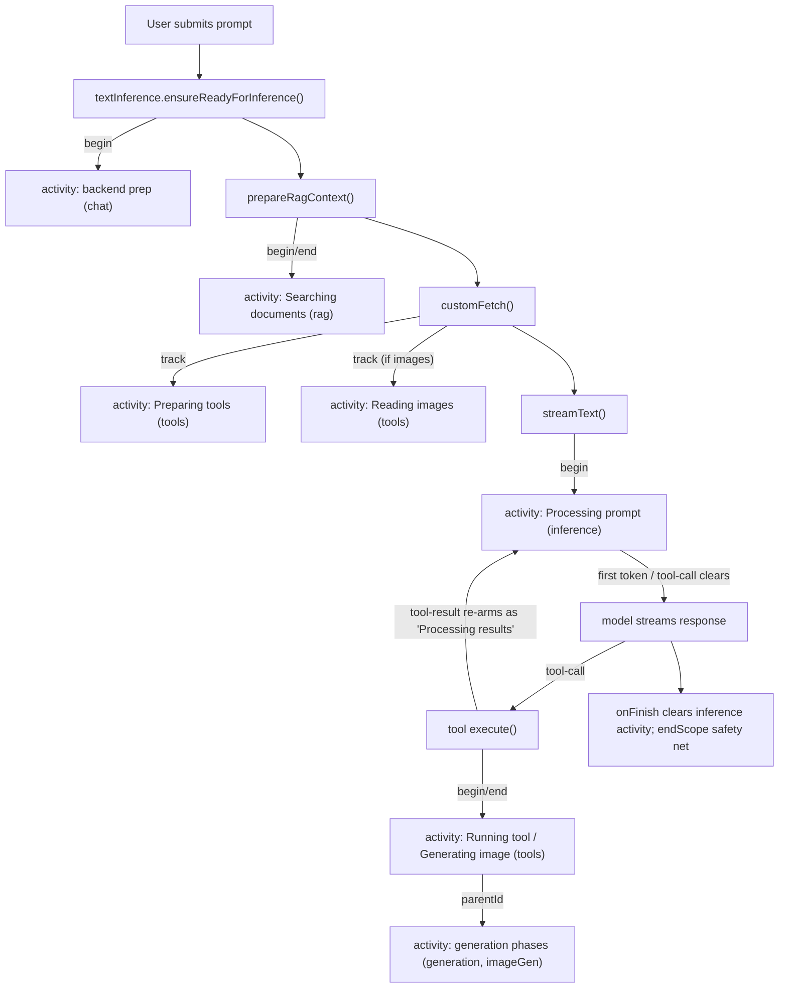

# Error, State & Activity Architecture

This document describes the cross-cutting primitives that the AI Playground desktop UI uses to
handle **errors**, **lifecycle/generation state**, and **long-running activity/progress**. These were
introduced to replace ad-hoc, per-call-site flags and toasts that had accreted over time and caused
inconsistent UX (different wordings, uncaught failures, silent waits, stuck spinners).

The guiding idea is **convergence**: each cross-cutting concern has a single typed model and a single
sink/source of truth, every producer reports into it, and the UI reads from it. New features plug in
by producing into these sinks rather than inventing their own state.

All paths below are relative to `WebUI/src/`.

---

## 1. Error model + sink

### Model

- [`assets/js/errors/types.ts`](../WebUI/src/assets/js/errors/types.ts) — the `AppError` type:
  `code`, `category`, `severity`, `surface`, `userMessage`, `technicalMessage`, `context`,
  `recoverable`, `action?`, `cause?`, `timestamp`. It is branded with a plain `__isAppError: true`
  literal (not a `Symbol`) so it survives structured-clone / IPC serialization. `SerializedAppError`
  is the IPC-safe subset.
- [`assets/js/errors/appError.ts`](../WebUI/src/assets/js/errors/appError.ts) — helpers:
  - `createAppError(input)` — build a typed error with sensible defaults.
  - `isAppError(value)` — brand check.
  - `toAppError(value, defaults?)` — coerce anything caught (Error, string, IPC failure, AppError)
    into an `AppError`, filling only the gaps the producer left blank.
  - `extractMessage(value)` — best-effort human message from any thrown value.
  - `serializeAppError` / `deserializeAppError` — cross the IPC boundary.

`ErrorCategory` = `backend | inference | generation | setup | channel | validation | unknown`.
`ErrorSurface` = `toast | inline | modal | silent` (how the sink presents it; defaults derive from
`severity`).

### Sink

- [`store/errors.ts`](../WebUI/src/assets/js/store/errors.ts) (`useErrors`) is the **only** place
  errors are surfaced. `report(value, overrides?)`:
  1. normalizes via `toAppError`,
  2. records into `recentErrors`,
  3. logs (`console.error` + structured),
  4. de-duplicates already-handled errors (tracked in a `WeakSet<AppError>`), and
  5. surfaces according to `surface` (toast / inline / modal / silent).
  `report()` returns the `AppError`, so call sites can `throw errors.report(...)` to both surface and
  propagate.

### Global capture

[`main.ts`](../WebUI/src/main.ts) wires the last-resort capture into the sink so nothing falls
through silently:
- `app.config.errorHandler` (Vue render/setup errors),
- `window.addEventListener('unhandledrejection', …)`,
- `window.addEventListener('error', …)`.

### Conventions

- Producers attach a stable `code` (e.g. `inference/stream-failed`, `generation/timeout`) and a
  concise `userMessage`. Verbose detail goes in `technicalMessage`.
- Background work (e.g. Home Agent side-channel turns) reports with `surface: 'silent'` so it is
  recorded/logged without a user toast.
- Never call `toast.error()` directly from feature code; go through `errors.report()`.
- User cancellation is not a failure. A deliberate cancel (e.g. closing the model-download dialog)
  is rejected as a benign, silent `AppError` built with `createCancellation()` (code
  `user/cancelled` = `CANCELLED_CODE`, `severity: 'info'`, `surface: 'silent'`). The sink logs it at
  `console.debug` (not `console.error`) and never toasts it. Consumers that care can detect it with
  `isCancellation(err)` to abort quietly; any uncaught cancel still lands in the global net silently.

---

## 2. App boot state machine

The app boot is an explicit FSM, not a pile of booleans:

```
verifyBackend → manageInstallations → loading → running | failed
```

- `globalSetup.loadingState` holds the current state; `App.vue` renders the screen for it.
- [`store/setupWizard.ts`](../WebUI/src/assets/js/store/setupWizard.ts) `initialize()` wraps the core
  init in `try/catch`. On failure it sets `loadingState = 'failed'` + `globalSetup.errorMessage`
  (reaching the previously-dead `failed` screen) and reports to the sink with `surface: 'silent'`
  and `severity: 'fatal'` (the screen already shows the message).
- [`store/presetSwitching.ts`](../WebUI/src/assets/js/store/presetSwitching.ts) reports switch
  failures through the sink and exposes `switchError`.

---

## 3. Generation lifecycle FSM (image / video / 3D)

Generation is modeled as an explicit FSM across two stores rather than loose flags.

- `GenerateState` ([`store/imageGenerationPresets.ts`](../WebUI/src/assets/js/store/imageGenerationPresets.ts))
  drives the overlay:
  `no_start → start_backend → install_workflow_components → load_workflow_components →
  load_model → load_model_components → generating → image_out`, plus `error`.
  `start_backend` exists specifically so the backend-boot / queued-retry window is never silent.
- `MediaItem.state` has terminal states `done | failed | stopped` — no permanent spinners.
  `failGeneration(msg)` / `cancelGeneration()` settle all in-flight items and set `lastError`;
  `WorkflowResult.vue` / `ChatWorkflowResult.vue` render a `failed` panel from `lastError`.
- **Watchdog** ([`store/comfyUiPresets.ts`](../WebUI/src/assets/js/store/comfyUiPresets.ts)) arms a
  timer on `execution_start` and clears it on success/error/interrupt; a stall reports
  `generation/timeout` and fails in-flight items.
- **Crash detection**: a watch on the ComfyUI service status fails in-flight items if the backend
  leaves `running` unexpectedly (guarded by `backendRestarting` so intentional restarts for
  custom-node installs don't false-positive). The main-process
  [`electron/subprocesses/service.ts`](../WebUI/electron/subprocesses/service.ts) also reports
  unexpected child exits.
- `summarizeComfyExecutionError` converts verbose ComfyUI `execution_error` payloads into a concise
  `userMessage` (size mismatch, OOM, file-not-found, …); full detail goes to `technicalMessage`.
- **Tool watchers** ([`tools/comfyUi.ts`](../WebUI/src/assets/js/tools/comfyUi.ts),
  [`tools/comfyUiImageEdit.ts`](../WebUI/src/assets/js/tools/comfyUiImageEdit.ts)) resolve on terminal
  item states and on watchdog timeout, returning an error result to the LLM instead of hanging.

---

## 4. Activity / progress sink

The newest primitive. It answers "**what is the app busy with right now**" with a single typed model
so that long, otherwise-silent waits (backend start, model load, RAG search, tool resolution,
thinking/TTFT, inter-step agentic pauses, image generation) get consistent UI feedback. It mirrors
the error sink in shape.

### Model

- [`assets/js/activities/types.ts`](../WebUI/src/assets/js/activities/types.ts) — the `Activity` type:
  `id`, `category`, `label`, `detail?`, `progress?` (0..1 or undefined = indeterminate), `scope`,
  `state`, `parentId?`, `startedAt`, `updatedAt`. Branded with `__isActivity: true`.
  - `ActivityCategory` = `backend | inference | rag | tools | generation | setup | unknown`.
  - `ActivityState` = `active | done | failed | cancelled`.
  - `ActivityScope` = `{ kind: 'global' } | { kind: 'chat'; conversationKey } | { kind: 'imageGen' }`.
- [`assets/js/activities/activity.ts`](../WebUI/src/assets/js/activities/activity.ts) —
  `createActivity()` / `isActivity()`.

### Sink

- [`store/activities.ts`](../WebUI/src/assets/js/store/activities.ts) (`useActivities`):
  - `begin(input): id` — start an activity.
  - `update(id, { label?, detail?, progress? })` — patch an in-flight activity.
  - `end(id, state = 'done')` — finish (moves it to a small `recent` ring buffer for debugging).
  - `track(input, fn)` — begin → run `fn` → end (`done`/`failed`); guarantees cleanup even on throw,
    so an activity can never get stuck (same philosophy as the generation watchdog).
  - `chatActivity(key, exclude?)` — the single activity to display for a chat turn: the **innermost**
    active activity that is chat-scoped for `key` **or a descendant of one via `parentId`** (so an
    image-gen phase started by a tool call surfaces on the chat turn). `exclude` skips categories the
    consumer renders elsewhere.
  - `imageGenActivity` — the latest active `imageGen`-scoped activity (for the desktop overlay).
  - `endScope(pred, state)` — anti-stuck reconciliation; end any active activity matching `pred`.
  - **No store dependencies** (like `errors` and `ui`) to avoid import cycles. Producers push;
    consumers read. Reconciliation lives in the producing stores that know when a turn finishes.

### Producers (where activities come from)

| Producer | Activity | Category | Scope |
|---|---|---|---|
| `textInference.start/completeBackendPreparation` | backend/model load (`preparationMessage`) | `backend` | chat (active conv) |
| `textInference.prepareRagContext` | "Searching documents…" | `rag` | chat |
| `openAiCompatibleChat.customFetch` (MCP instructions / tool resolution) | "Preparing tools…" | `tools` | chat |
| `openAiCompatibleChat.customFetch` (image→base64) | "Reading images…" | `tools` | chat |
| `openAiCompatibleChat` stream `onChunk`/`onFinish` | "Processing prompt…" (TTFT) / "Processing results…" (post-tool inter-step) | `inference` | chat |
| MCP `dynamicTool.execute` | "Running &lt;tool&gt;…" | `tools` | chat |
| `tools/comfyUi.ts` / `comfyUiImageEdit.ts` | "Generating/Editing image…" | `tools` | chat (parent) |
| `comfyUiPresets` FSM bridge | generation phase (+ determinate progress from WS) | `generation` | imageGen, nested under the tool activity via `generationParentActivityId` |

The inference activity ("Processing prompt…", or "Processing results…" once a tool has run) is begun
before `streamText`, cleared on first content / tool call, and re-armed after a tool result (so
inter-step agentic pauses are visible). The chat store also runs a
safety-net watch on `processing`: when a turn ends it calls `endScope(...)` to clear any lingering
chat `inference`/`tools` activities (covers stop / stream errors where `onFinish` never fires).

### Consumers

- [`components/ChatActivityIndicator.vue`](../WebUI/src/components/ChatActivityIndicator.vue) — reads
  `chatActivity(conversationKey, ['generation'])` and renders an indeterminate `LoadingBar` (or a
  determinate bar when `progress` is set). It is anchored to the **bottom of the in-progress chat
  turn** in [`views/Chat.vue`](../WebUI/src/views/Chat.vue) (it replaced the old sticky
  `isPreparingBackend` bar). `generation` is excluded because the inline `ChatWorkflowResult` already
  visualizes image-gen thumbnails + steps; the indicator keeps the parent "Generating image…" line.
- [`views/PromptArea.vue`](../WebUI/src/views/PromptArea.vue) — `isProcessing` includes
  `chatActivity(activeKey) !== null`, so the send/stop control matches the indicator even during
  backend prep / tool / thinking phases when the stream flag isn't set yet.
- Image-gen overlays (`WorkflowResult.vue` / `ChatWorkflowResult.vue`) remain driven by the
  `GenerateState` FSM (the source the generation activity is derived from); the activity mirrors that
  state for the unified chat indicator.

### A chat turn, end to end



The `ChatActivityIndicator` shows whichever of these is innermost at any moment, giving a continuous
status line across the whole turn.

---

## 5. Adding new cross-cutting state

- **New failure path** → build an `AppError` with `createAppError(...)` (stable `code`, concise
  `userMessage`) and call `errors.report(...)`. Pick `surface` deliberately; use `silent` for
  background work.
- **New long-running step** → wrap it with `activities.track({ category, label, scope }, fn)`, or
  `begin`/`update`/`end` for streaming progress. Use `parentId` to nest under a higher-level activity
  so the chat indicator can show the most-specific label. Add the label to
  [`assets/i18n/en-US.json`](../WebUI/src/assets/i18n/en-US.json) (`COM_ACTIVITY_*`); other locales
  fall back to en-US automatically.
- **New backend with its own lifecycle** → model it as an explicit FSM (see the generation FSM) with
  terminal states and a watchdog, and emit a `backend`/`generation` activity for the boot window.
