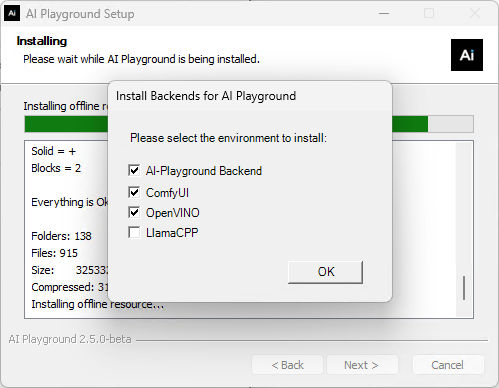
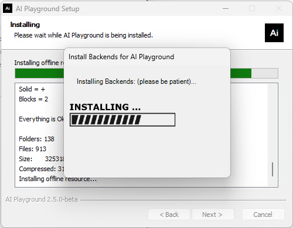

# Offline Package Build

## Prepare Python 3.12 environment

1. run `npm install`
2. aquire windows libuv dlls, e.g. via miniforge:
   - Install miniforge: https://github.com/conda-forge/miniforge
   - Create a reference conda environment with libuv installed
   ```
   conda create -n cp312_libuv python=3.12 libuv -y
   # copy the path to this conda env
   conda env list | findstr cp312_libuv
   ```

## Create the Offline Package

```
run `npm run prepare-offline-package:win -- --conda_env_dir=$PATH_TO_CONDA_ENV`
```

You should now have the offline package like "ap-offline-pkg-[version].7z" in the `release` folder.

## Usage of the offline package

Just place the file of offline package in the same directory as the installer package.

During the installation process, there will be a selection interface for you to choose the environment that needs to be pre-installed:





The installation time for the environments is a bit long and there is no progress bar so far, please be patient.